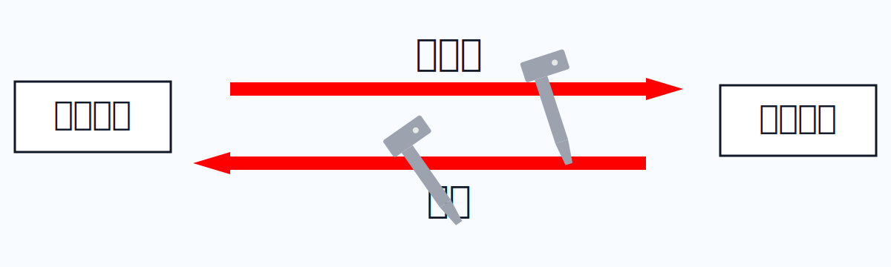
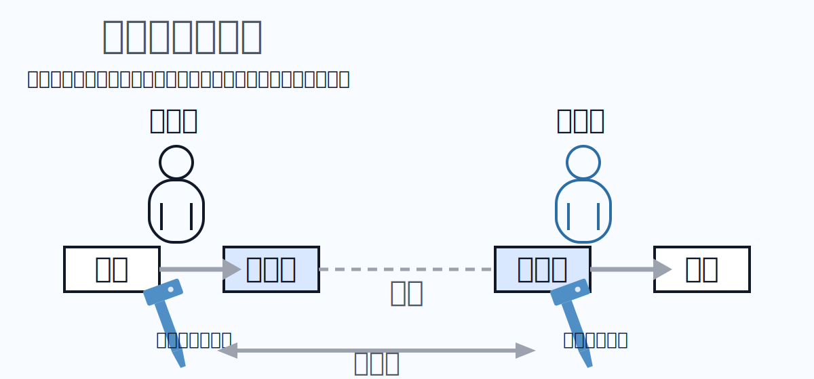
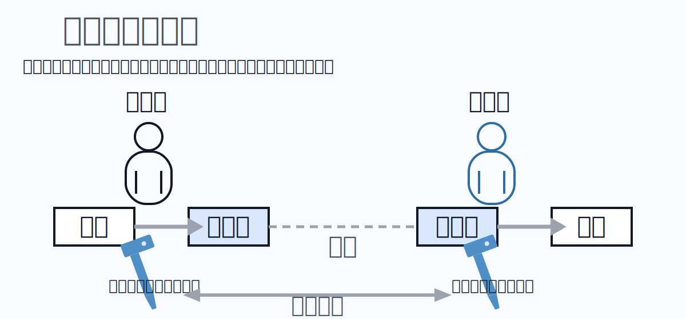
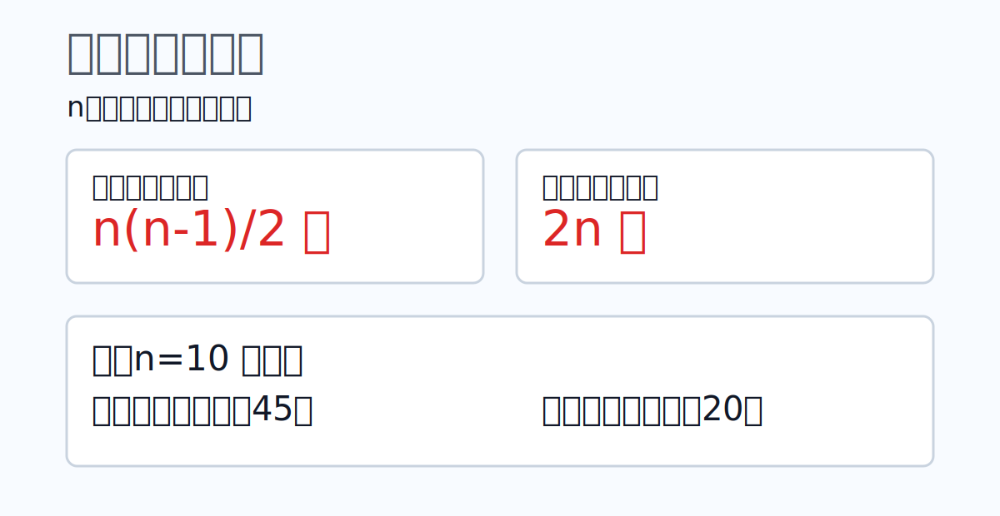

# 暗号技术知识点

## 1. 什么是加密？

加密是把明文通过算法与密钥转换为难以理解的密文；复号则使用对应密钥还原为明文。

## 2. 共通键加密方式（对称加密）

对称加密使用同一把密钥进行加密与复号。优点是处理速度快、实现简单；缺点是密钥分发与管理复杂，通信对象越多管理成本越高。

## 3. 公开键加密方式（非对称加密）

非对称加密使用不同密钥：公开键用于加密，秘密键用于复号。优点是密钥分发更容易；缺点是计算开销相对更高，速度通常慢于对称加密。

## 4. 所需密钥数量（规模比较）

当 `n` 个成员两两通信时：

- 共通键方式：`n(n-1)/2`
- 公开键方式：`2n`

结论：人数变多后，共通键管理复杂度增长更快。

## 5. AES

AES（Advanced Encryption Standard）是广泛使用的共通键分组加密算法，常见密钥长度为 128/192/256 bit，具有速度快、强度高等特点。

## 6. RSA 加密

RSA 是典型公开键加密算法，安全性依赖大整数素因数分解困难性，常用于 HTTPS、数字签名与密钥交换。

## 7. 混合加密方式（Hybrid）

混合加密结合公开键与共通键优点：先用公开键安全传输会话密钥，再用共通键进行高速数据加密。

## 8. CRYPTREC 密码清单

CRYPTREC 是日本密码技术评估相关项目，公开推荐算法清单，常作为政府和企业密码选型参考。

## 9. 危殆化（安全性劣化）

危殆化是指原本安全的密码算法，因算力提升或分析方法进步而变得更易被破解，导致实际安全强度下降。
